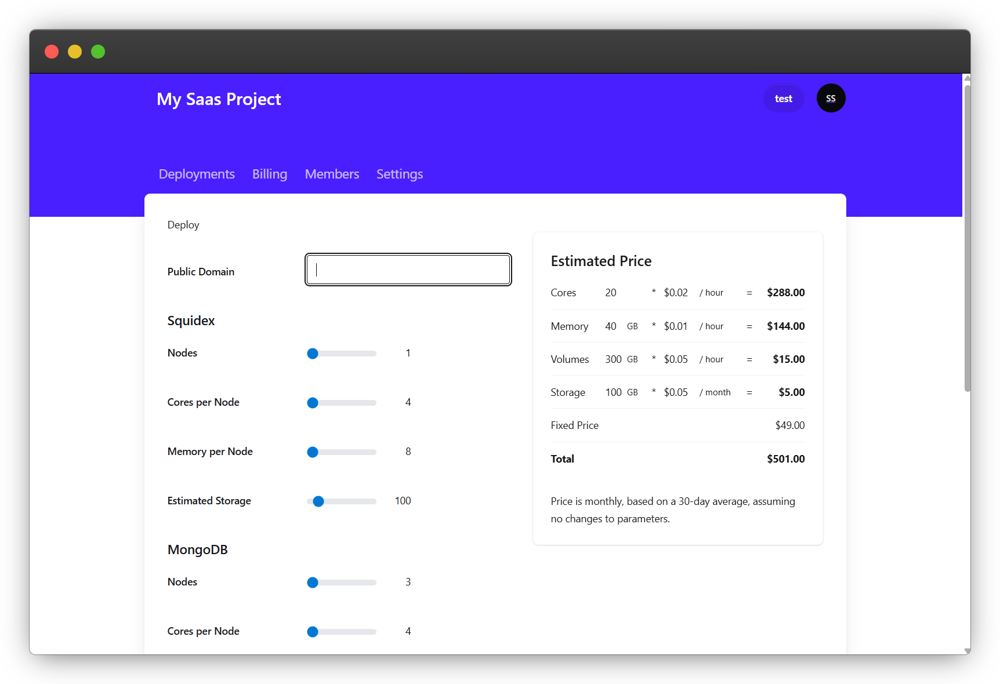
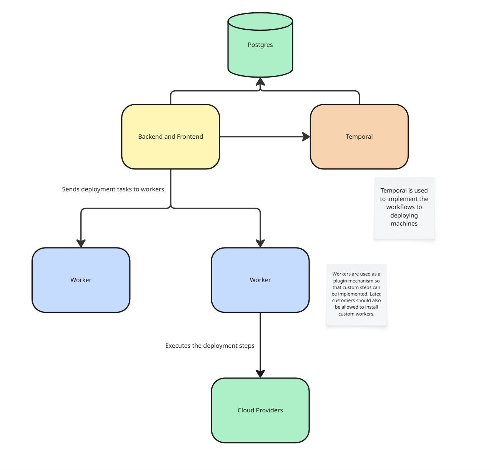

# OmniSaaS (working title)

> **OmniSaaS** is a modular deployment platform tailored for SaaS providers.
> 
> It simplifies infrastructure provisioning by offering:
> 
> - A **backend API** to define deployment blueprints and manage versions.
> - Integration with external **billing providers** (e.g., Stripe).
> - A **customer-facing portal** to let users self-deploy their SaaS instance on demand.

Whether you're offering a monolithic app or a collection of microservices, OmniSaaS helps you deploy reproducible, scalable environments — all while keeping your cost-to-profit ratio in check.




## Architecture and Concept



The architecture is super simple so that it will be easy to deploy it.

- **Backend**: Manages all deployments and orchestrates workflows via [Temporal](https://temporal.io/).
- **Workers**: Microservices that create or update resources based on deployment definitions.
- **Frontend**: Customer-facing portal for self-service provisioning.

### Deployment definitions

Deployment definitions are written in JSON or YAML and specify the parameters and resources for a SaaS instance.

```yaml
{
  "parameters": [
    {
      "name": "domain",
      "type": "string",
      "required": true
    },
    {
      "name": "mongoDbNodes",
      "type": "number",
      "required": true,
      "default": 1,
      "minimumValue": 3,
      "maximumValue": 12,
      "section": "MongoDB"
    },
    ....
  ],
  "resources": {
    {
      "name": "Storage",
      "type": "vulture-storage",
      "parameters": {
        "apiKey": "${env.apiKey}"
      }
    },
    {
      "name": "Squidex and MongoDB",
      "type": "helm",
      "parameters": {
        "k8Config": "${env.apiKey}",
        "mongodb.numNodes": "${parameters.mongoDbNodes}",
        "mongodb....": "",
      }
    }
  },
  "usage": {
    "totalCpus": "${parameters.mongoDbNodes * parameters.mongoDbCoresPerNode + (parameters.squidexNodes + 1) * parameters.squidexCoresPerNode}",
    "totalMembery": "${parameters.mongoDbNodes * parameters.squidexDbMemoryPerNode + (parameters.squidexNodes + 1) * parameters.squidexDbMemoryPerNode}",
    "totalStorage": "${parameters.mongoDbNodes * parameters.mongoDbStoragePerNode}"
  }
}
```

## 🛠 Resource Provisioning Philosophy

OmniSaaS does **not** reinvent infrastructure-as-code. Instead, it builds on top of existing tools:

- **Docker Compose**: For local or single-node deployments
- **Kubernetes + Helm**: For scalable cloud-native services
- **Terraform**: For declarative infrastructure (where supported)

This approach ensures:
- Lower learning curve
- Portability between local and production environments
- Modular extension with existing CI/CD tooling

### Is the definition schema complete?

No, the schema is evolving. Key future additions include:

- Health checks per resource
- Parameter mapping
- Parameter validation constraints (beyond simple min/max)

### Why multiple resource types?

Some providers or tools only support specific infrastructure:

- Helm is powerful but may lack support for external resources like storage (S3) and domains.
- Terraform excels in some areas but is not universal

OmniSaaS mixes and matches tools to provide the best coverage.

### Which cloud providers are supported?

While theoretically cloud-agnostic, OmniSaaS is optimized for affordable, global hosting providers like:

* [DigitalOcean](https://digitalocean.com)
* [Vultr](https://vultr.com)

These allow you to offer services at a profit margin (~60%) with predictable pricing.

### What will it cost for my customers?

It depends on your configuration. For example:

- A simple Docker Compose setup could run on a $20/month VPS.
- You could resell such a service for ~$50/month, depending on features and support.

Use your deployment definitions to estimate and communicate costs transparently.

### Why are you building this?

I want to provide better hosting options to my customers for my existing applications:

* https://github.com/squidex/squidex
* https://github.com/notifo-io/notifo

## How to start

The main project has two parts, the backend and frontent. You have to run them individually:

### Backend

```
cd backend
npm i
npm run start
  - or -
npm run start:debug for debugging with chrome
```

#### Certificates (ONE TIME)

Before you can start running the backend you have to create local dev certificates. We need https for the authentication flow, because a cookie is set before a redirecting to an exernal authentication provider and this cookie is only available when you run the site with https. At the moment we use [mkcert](https://github.com/FiloSottile/mkcert) for that.

Follow the installation instructions from the repository: https://github.com/FiloSottile/mkcert

First you have to register the certificate authority in your system.

```
mkcert -install
```

Then create the local dev certificates!

If you are in the root folder:

```
mkcert -cert-file backend/dev/local-dev.pem -key-file backend/dev/local-dev-key.pem localhost
```

Or if you are in the backend folder

```
mkcert -cert-file dev/local-dev.pem -key-file dev/local-dev-key.pem localhost
```

#### Configuration

At the moment we use a free cloud server for that. Just ask one of the team members for credentials and put the `.env` file to the backend folder.
Before we can start the backend, we need a running postgres database. See `dev/postgress/docker-compose`

### Frontend

```
cd frontend
npm i
npm run dev
```

## Contributing

We welcome contributions from developers of all skill levels.

### How to contribute:

1. Fork this repository
2. Create a feature branch (`git checkout -b feature/xyz`)
3. Commit your changes clearly
4. Push to your fork and open a Pull Request

Before submitting:
- Make sure all code is formatted and linted
- Include tests where possible
- Describe what the change does and why it matters

If you are planning to work on a bigger features, let schedule a call first to discuss the details.

## Tech Stack

### Backend

* NestJS
* Node
* Typescript
* Go (planned for the CLI)

#### Frontend

* React
* React Form Hooks
* React Query
* Tailwind
* Zustand