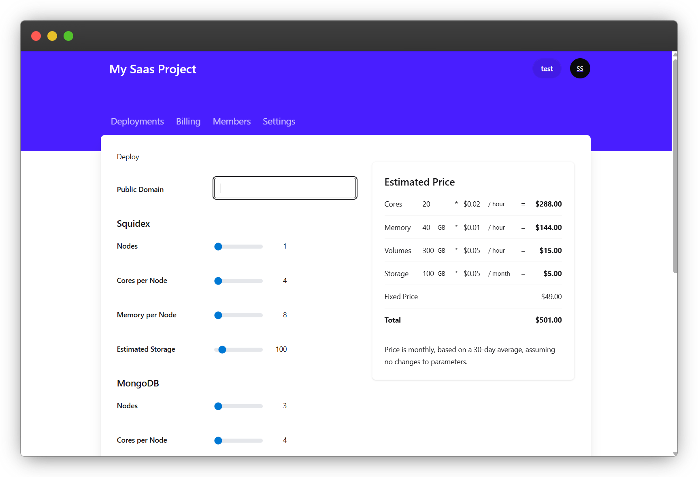
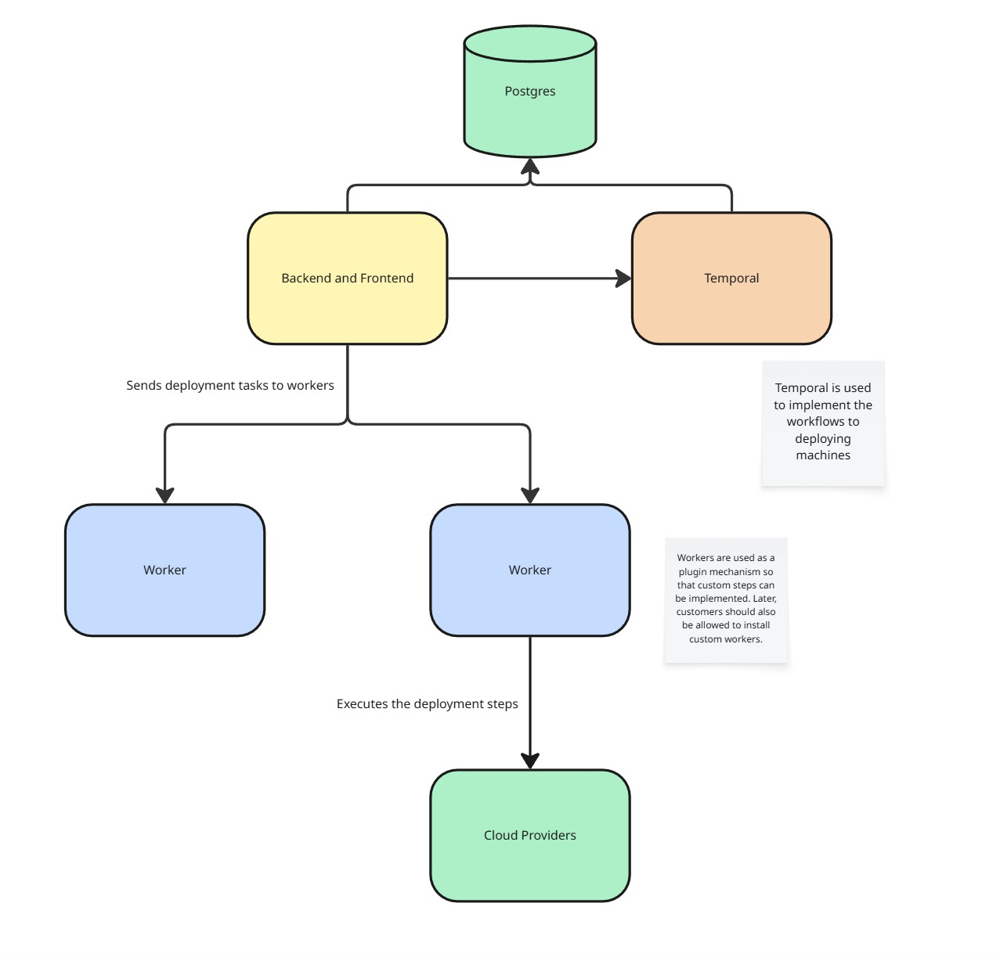

# Pangostack

> **Pangostack** is a modular deployment platform tailored for SaaS providers.
> 
> It simplifies infrastructure provisioning by offering:
> 
> - A **backend API** to define deployment blueprints and manage versions.
> - Integration with external **billing providers** (Chargebee).
> - A **customer-facing portal** to let users self-deploy their SaaS instance on demand.

📚 **Documentation:** [Writing deployment definitions](docs/DEFINITIONS.md) · [Self-hosting Pangostack](docs/HOSTING.md)

### Features

* Various pricing models
  * Fixed prices
  * Pay per usage
  * Pay per month, depending on selection
* Billing providers
  * Chargebee
* Resources
  * Vultr VM (provides SSH connection)
  * Vultr S3 Storage
  * Docker Compose (based on SSH connection)
  * Helm

Whether you're offering a monolithic app or a collection of microservices, Pangostack helps you deploy reproducible, scalable environments — all while keeping your cost-to-profit ratio in check.




## Architecture and Concept



The architecture is super simple so that it will be easy to deploy it.

- **Backend**: Manages all deployments and orchestrates workflows via [Temporal](https://temporal.io/).
- **Workers**: Microservices that create or update resources based on deployment definitions.
- **Frontend**: Customer-facing portal for self-service provisioning.

### Deployment definitions

Deployment definitions are written in JSON or YAML and specify the parameters and resources for a SaaS instance.

```yaml
---
parameters:
- name: domain
  label: Public Domain
  type: string
  required: true
  display: true
- name: plan
  label: Plan
  type: string
  required: true
  display: true
  allowedValues:
  - value: cores_4
    label: 4 Cores, 8 GB RAM, 160 GB SSD
  - value: cores_8
    label: 8 Cores, 32 GB RAM, 640 GB SSD
  - value: cores_16
    label: 16 Cores, 64 GB RAM, 1280 GB SSD
afterInstallationInstructions: 'Create a new A record from your domain '
pricingModel: fixed
resources:
- name: Virtual Machine
  id: vm
  type: vultr-vm
  parameters:
    apiKey: "${env.apiKey}"
  mappings:
    plan:
      value: "${parameters.plan}"
      map:
        cores_4: vc2-4c-8gb
        cores_8: vc2-8c-32gb
        cores_16: vc2-16c-64gb
- name: Squidex
  id: squidex
  type: docker-compose-ssh
  parameters:
    dockerComposeUrl: https://raw.githubusercontent.com/Squidex/squidex-hosting/refs/heads/master/docker-compose/docker-compose.yml
  healthChecks:
  - name: Default
    url: https://${parameters.domain}/healthz
    type: http
prices:
- target: "${parameters.plan}"
  test: cores_4
  amount: 80
usage:
  totalCores: "${parameters.mongoDbNodes * parameters.mongoDbCoresPerNode + (parameters.squidexNodes
    + 1) * parameters.squidexCoresPerNode}"

```

## 🛠 Resource Provisioning Philosophy

Pangostack does **not** reinvent infrastructure-as-code. Instead, it builds on top of existing tools:

- **Docker Compose**: For local or single-node deployments
- **Kubernetes + Helm**: For scalable cloud-native services
- **Terraform**: For declarative infrastructure (where supported)

This approach ensures:
- Lower learning curve
- Portability between local and production environments
- Modular extension with existing CI/CD tooling

### Is the definition schema complete?

No, the schema is evolving. Key future additions include:

- Health checks per resource
- Parameter mapping
- Parameter validation constraints (beyond simple min/max)

### Why multiple resource types?

Some providers or tools only support specific infrastructure:

- Helm is powerful but may lack support for external resources like storage (S3) and domains.
- Terraform excels in some areas but is not universal

Pangostack mixes and matches tools to provide the best coverage.

### Which cloud providers are supported?

While theoretically cloud-agnostic, Pangostack is optimized for affordable, global hosting providers like:

* [DigitalOcean](https://digitalocean.com)
* [Vultr](https://vultr.com)

These allow you to offer services at a profit margin (~60%) with predictable pricing.

### What will it cost for my customers?

It depends on your configuration. For example:

- A simple Docker Compose setup could run on a $20/month VPS.
- You could resell such a service for ~$50/month, depending on features and support.

Use your deployment definitions to estimate and communicate costs transparently.

### Why are you building this?

I want to provide better hosting options to my customers for my existing applications:

* https://github.com/squidex/squidex
* https://github.com/notifo-io/notifo

## Project structure

Pangostack is three independent npm packages (each manages its own dependencies) plus a tooling-only
root. To **self-host** Pangostack, follow [docs/HOSTING.md](docs/HOSTING.md) — this section is about
running it locally for development.

| Package     | What it is                                                                  | Dev port          |
| ----------- | --------------------------------------------------------------------------- | ----------------- |
| `backend/`  | NestJS API — services, deployments, teams/users, billing, Temporal workflows | 3000 (HTTPS)      |
| `worker/`   | NestJS microservice — provisions infra (Vultr, S3, Docker Compose/SSH, Helm) | 3100 (HTTP)       |
| `frontend/` | Vite + React customer portal and admin UI                                   | 5173              |

The backend orchestrates deployments through [Temporal](https://temporal.io/) and calls the worker
over REST. For how the pieces fit together, see [CLAUDE.md](CLAUDE.md).

## Running locally

### 1. Prerequisites (one time)

Local HTTPS certificates are required — the auth flow sets a cookie before redirecting to external
identity providers, and browsers only keep that cookie over HTTPS. We use
[mkcert](https://github.com/FiloSottile/mkcert):

```bash
mkcert -install                     # register the local certificate authority
cd backend && npm run mkcert:create # writes dev/local-dev*.pem, then: cd ..
```

Create a `backend/.env` from [`backend/.env.example`](backend/.env.example) (credentials are not in
the repo). Environment variables are validated with Joi at startup, so a missing required value fails
fast with a clear message.

### 2. Install and run everything

From the repo root:

```bash
npm run install:all   # installs the root + all three packages
npm run dev           # brings up Postgres + pgadmin, then runs Temporal, backend, worker and frontend
```

`npm run dev` starts the docker-compose infrastructure and waits until Postgres is healthy, then runs
all four processes concurrently with prefixed output. Related scripts: `dev:infra` /
`dev:infra:down` (infrastructure only) and `dev:backend` / `dev:worker` / `dev:frontend` /
`dev:temporal` (a single process). Each package also has its own `npm run dev` (watch mode),
`npm run build` and `npm run lint`.

> Temporal runs via the CLI (`temporal server start-dev`) and keeps its state in memory, so workflow
> history is lost on restart. See [CLAUDE.md](CLAUDE.md) for how to persist it.

## Testing

The backend and worker use [vitest](https://vitest.dev/):

```bash
cd backend && npm test        # unit tests
cd backend && npm run test:int  # integration tests (TestContainers-backed Postgres)
cd worker  && npm test        # unit tests
```

CI (`.github/workflows/deploy.yml`) builds the Docker images on every pull request and push to `main`.
Each image build lints, builds and unit-tests its package, so any failure blocks the image; the push to
Docker Hub only happens on `main`.

## Observability

Pangostack is instrumented with [OpenTelemetry](https://opentelemetry.io/), the open standard for
traces and metrics. It is **opt-in**: the backend and worker only start the OTel SDK when an OTLP/HTTP
collector endpoint is configured, so local development is unaffected. Enable it by setting:

```bash
OTEL_EXPORTER_OTLP_ENDPOINT=http://localhost:4318   # your collector's OTLP/HTTP endpoint
OTEL_SERVICE_NAME=pangostack-backend                # optional; sensible per-service defaults apply
```

Because the backend calls the worker over instrumented HTTP, a deployment is traced end to end
(`pangostack-backend` → `pangostack-worker`) once a collector is set up. Point the endpoint at any
OTLP-compatible collector (OpenTelemetry Collector, Grafana Tempo/Alloy, Jaeger, Honeycomb, ...).

Instrumented out of the box (via `@opentelemetry/auto-instrumentations-node`): HTTP, Express, NestJS,
Postgres (`pg`), Winston, the AWS SDK and more. The backend additionally loads TypeORM instrumentation
(`opentelemetry-instrumentation-typeorm`), which is not part of the auto bundle, so database access
shows up as ORM-level spans (entity, method, SQL) on top of the raw driver spans. Add further
instrumentations in `backend/src/tracing.ts` / `worker/src/tracing.ts`.

## Contributing

We welcome contributions from developers of all skill levels.

### How to contribute:

1. Fork this repository
2. Create a feature branch (`git checkout -b feature/xyz`)
3. Commit your changes clearly
4. Push to your fork and open a Pull Request

Before submitting:
- Make sure all code is formatted and linted
- Include tests where possible
- Describe what the change does and why it matters

If you are planning to work on a bigger features, let schedule a call first to discuss the details.

## Tech Stack

### Backend

* NestJS
* Node
* Typescript
* Go (planned for the CLI)

#### Frontend

* React
* React Form Hooks
* React Query
* Tailwind
* Zustand
